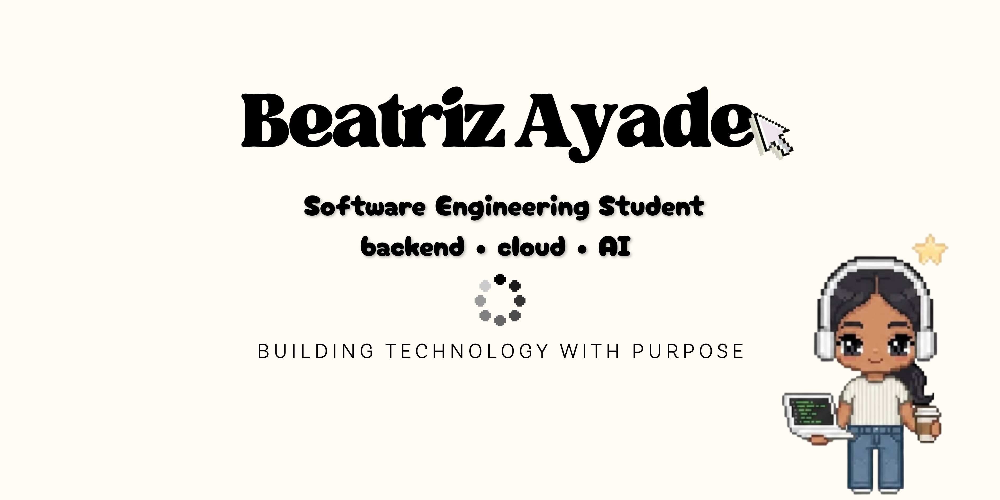

  

# Beatriz Ayade

### Software Engineering Student

*Building technology with purpose.*

 

# 🌷 About Me

I'm a Software Engineering student passionate about creating technology that solves real-world problems.

I enjoy building projects that combine software engineering, backend development, cloud computing and artificial intelligence.

Currently, I'm focused on becoming a Backend Developer while exploring scalable architectures and meaningful applications.

Outside programming, you'll probably find me reading, learning new languages or watching films.

# ☁️ Tech Stack

# 🌱 Currently Learning

- Backend Development
- REST APIs
- Cloud Computing (AWS)
- SQL & Database Design
- Software Architecture
- Artificial Intelligence

# 📝 Featured Projects

## ♻️ LoopLook

A platform that encourages circular fashion through technology.

> Under development

## 📕 Language Journal

An intelligent journal powered by AI, computer vision and IoT.

> Coming soon

## 📚 More projects coming soon...

# 💡 *"Technology becomes meaningful when it solves real problems."*

Thanks for visiting my profile ✨

